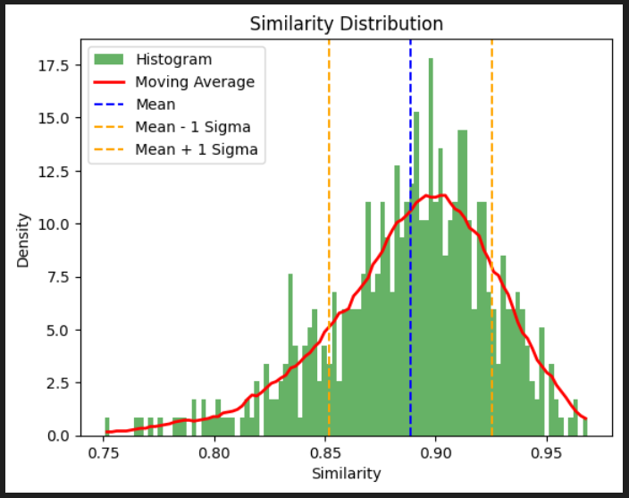
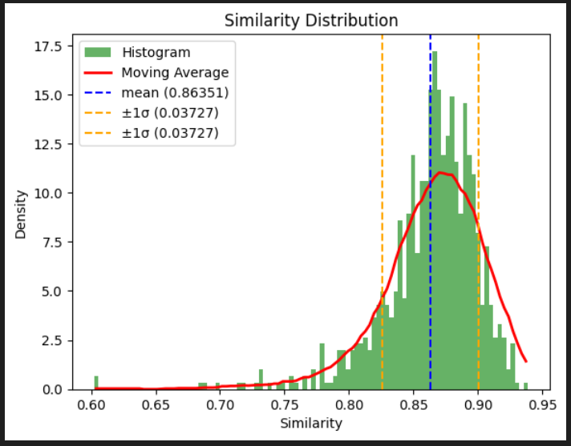

The goal is to analyse texts by generating vector embeddings using AI. I'd like to search and compare different sources to uncover similarities.

> I'm working on this just for fun and the repo is a work-in-progress.

---
# Overview

Overview:
- [Generating Text Embeddings](#generate_text_embedding)
- [Getting Data](#getting_data)
- [Comparing Data](#comparing_data)
- [Building an App](#building_app)
- [Experimenting with AI Summaries](#ai_summaries)

Run locally:
- [Setup](#setup)
---

## <a id="generate_text_embedding"></a>Generating Text Embeddings

> Text embeddings are vector representations of text that map the original text into a mathematical space where words or sentences with similar meanings are located near each other. <sup>[src](https://www.geeksforgeeks.org/what-is-text-embedding/)</sup>

I use the [Alibaba-NLP/gte-multilingual-base](https://huggingface.co/Alibaba-NLP/gte-multilingual-base) model to generate embeddings.
See [playground_0_embedding.ipynb](playground_0_embedding.ipynb) for an example.

---

## <a id="getting_data"></a>Getting Data
I explore different approaches.

1. downloading arXiv PDFs to perform full text analysis. See:
    - [playground_1_arxiv_download.ipynb](playground_1_arxiv_download.ipynb), some utilities for me to bulk download arXiv PDFs
    - [playground_2_paper.ipynb](playground_2_paper.ipynb), full text processing, splitting a PDF into multiple embeddings
    - [playground_3_process_pdf.ipynb](playground_3_process_pdf.ipynb), some utilities to process a directory full of PDFs.
2. download only arXiv metadata and use `title+abstract` to analyse. See:
    - [playground_5_elastic_metadata.ipynb](playground_5_elastic_metadata.ipynb), showcasing the process of locally setting up a Elastic search database to persist the processed metadata (2.7mio records atm, ~4.5GB)

---

## <a id="comparing_data"></a>Comparing Data
Once I have processed data (Text + Embeddings) I can start comparing and plotting those embeddings to see which texts are similar.

For example, in [playground_4a_comparison.ipynb](playground_4a_comparison.ipynb) I calculate 1 embedding representing the whole paper content and use this for plotting.


In [playground_4b_similarity_search.ipynb](playground_4b_similarity_search.ipynb) I used this search papers matching my query.

---

## <a id="building_app"></a>Building an App
All the experiments worked more or less good but I felt like to actually get the best results I
1. need way more data, and
2. need a better way to interact with it

I ended up with the following setup:


This allows me to build an app using the full capabilities of HTML and JavaScript and utilize powerful functions in the [Python backend](web_backend.py).

To start, I implemented `match_phrase` (search by text) and `KNN query by vector` (search by embedding) search capabilities:


I then added a graph to visualize the most similar papers for a given one, with abstract preview and the ability to expand nodes as desired:


I have plans to build upon this and add more novel functionality to explore the arXiv papers.

---

## <a id="ai_summaries"></a>Experimenting with AI Summaries

I was wondering if value were to be gained by normalizing paper abstracts into a fixed form.
See: [playground_6_abstract_summary.ipynb](playground_6_abstract_summary.ipynb).
For this I defiend a JSON layout of what information I'd like to have and in what order for each paper, like this:
```json
{
    "title": "...",
    "contributions": [ ... ],
    "problems_or_goals": [ ... ],
}
```

The model used for this task was [gemma3:latest](https://ollama.com/library/gemma3:4b) (4b params) inferenced locally using ollama. This is a relatively small model but the results were okay. Processing 1 paper took ~1.5 sec. Processing all of arXiv like this (~2.7mio papers atm) would take ~1.5 months - a commitment I'm not willing to make as of writing.

So, to see if it would be worthwhile I processed ~500 papers to see how different the resulting embeddings actually were:



Now, with most of them being ~90% similar on average, I'm still not willing to process 2.7mio papers...

I'm curious how differently the AI model would summarize a paper if it had more than just the abstract. I guess that's something I could try next.

---

Furthermore, I tried comparing:
- embeddings generated just using the abstract, vs.
- chunking the full paper, calculating the embeddings for all chunks, then taking the mean of those.

See: [playground_6c_abstract_vs_paper.ipynb](playground_6c_abstract_vs_paper.ipynb)



For this batch the result indicates a lower mean similarity with a wider spread, meaning that a mean embedding over the full paper is more different to the embedding generated using just the abstract, compared to the difference between letting an AI summarize the abstract. 

This makes sense, I guess. The AI can just summarize what is has seen, while full text processing most certainly includes information that was not present in the abstract, further changing its semantic representation. I'm still surprised by how similar they are overall, though the compute necessary to calculate all of those embeddings when doing a full text analysis is much bigger compared to calculating just the one for the abstract. I guess that means that (most) scientific authors are relatively good at summarizing their works in the abstract.


---
# <a id="setup"></a>Setup
Tested on Windows.

## Python
```bash
py -m venv .venv
.\.venv\Scripts\activate
pip3 install -r .\requirements.txt
```

## Web-Backend
```bash
.\.venv\Scripts\activate
py .\web_backend.py
```

This should start the backend server on http://localhost:3001

## Web-Frontend
```bash
cd .\web_frontend\
npm install
npm run dev
```
This should open locally on http://localhost:3000/

and to build a distributable
```bash
npm run build
```