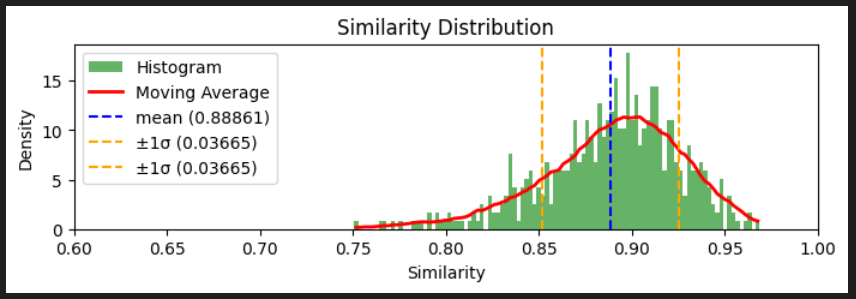
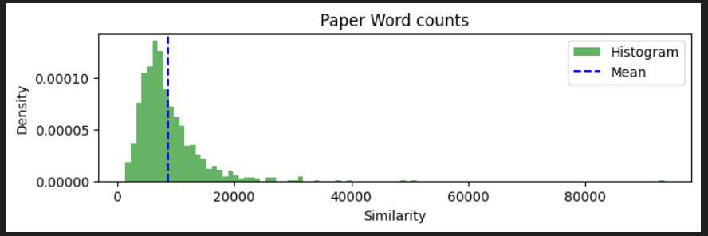
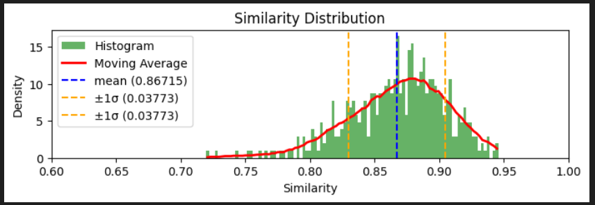
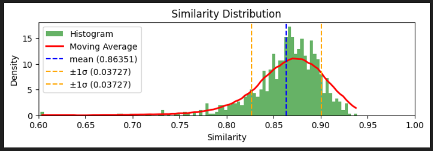
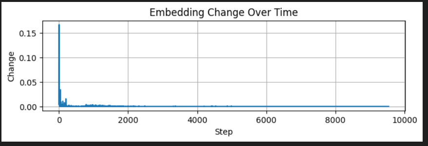
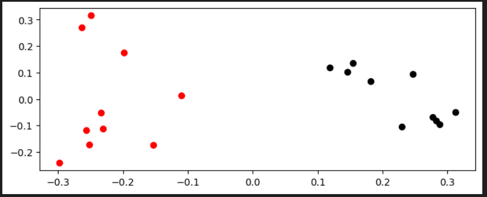
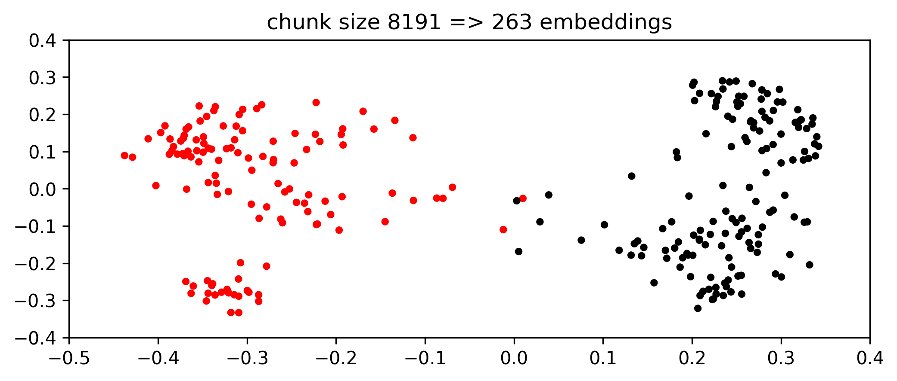

The goal is to analyse texts by generating vector embeddings using AI. I'd like to search and compare different sources to uncover similarities.

> I'm working on this just for fun and the repo is a work-in-progress.

---
# Overview

- [Setup](#setup)

Documentation:
- [Generating Text Embeddings](#generate_text_embedding)
- [Getting Data](#getting_data)
- [Initial Testing](#initial_testing)
- [Building an App](#building_app)
- [Different Approaches to Generating Embeddings ](#embedding_approaches)
- [Different Chunk Sizes](#different-chunk-sizes)

---

## <a id="generate_text_embedding"></a>Generating Text Embeddings

> Text embeddings are vector representations of text that map the original text into a mathematical space where words or sentences with similar meanings are located near each other. <sup>[src](https://www.geeksforgeeks.org/what-is-text-embedding/)</sup>

I mostly use the [Alibaba-NLP/gte-multilingual-base](https://huggingface.co/Alibaba-NLP/gte-multilingual-base) model to generate embeddings unless otherwise stated.
See [playground_0_embedding.ipynb](playground_0_embedding.ipynb) for an example.

---

## <a id="getting_data"></a>Getting Data
I explore different approaches to get large amounts of data.

1. downloading arXiv PDFs to perform full text analysis. See:
    - [playground_1_arxiv_download.ipynb](playground_1_arxiv_download.ipynb), some utilities for me to bulk download arXiv PDFs
    - [playground_2_paper.ipynb](playground_2_paper.ipynb), full text processing, splitting a PDF into multiple embeddings
    - [playground_3_process_pdf.ipynb](playground_3_process_pdf.ipynb), some utilities to process a directory full of PDFs.
2. download only arXiv metadata and use `title+abstract` to analyse. See:
    - [playground_5_elastic_metadata.ipynb](playground_5_elastic_metadata.ipynb), showcasing the process of locally setting up a Elastic search database to persist the processed metadata (2.7mio records atm, ~4.5GB)

---

## <a id="initial_testing"></a>Initial Testing
Once I have the data I can start with some initial tests.
To process the data I generate an embedding of the combined text `Title+Abstract`

For example, in [playground_4a_comparison.ipynb](playground_4a_comparison.ipynb) I calculate 1 embedding for each paper and use this for plotting to see which papers are similar.


In [playground_4b_similarity_search.ipynb](playground_4b_similarity_search.ipynb) I used this to search papers that match my query.

---

## <a id="building_app"></a>Building an App
All the experiments worked more or less good but I felt like to actually get the best results I
1. need way more data, and
2. need a better way to interact with it

I ended up with the following setup:


This allows me to build an app using the full capabilities of HTML, CSS and JavaScript and utilize powerful functions in the [Python backend](web_backend.py).

To start, I implemented `match_phrase` (search by text) and `KNN query` (search by embedding) search capabilities. This allows me to find papers that include the exact phrasing as well as ones that are semantically similar:


I then added a graph to visualize the most similar papers for a given one, with abstract preview and the ability to expand nodes as desired:


I have plans to build upon this and add more novel functionality to explore the arXiv papers.

---

## <a id="embedding_approaches"></a>Different Approaches to Generating Embeddings 

I was wondering if value were to be gained by normalizing paper abstracts into a fixed form.
See: [playground_6a_abstract_summary.ipynb](playground_6a_abstract_summary.ipynb).
For this I defiend a JSON layout of what information I'd like to have and in what order for each paper, like this:
```json
{
    "title": "...",
    "contributions": [ ... ],
    "problems_or_goals": [ ... ],
}
```

The model used for this task was [gemma3:latest](https://ollama.com/library/gemma3:4b) (4b params) inferenced locally using ollama. This is a relatively small model but the results were okay. Processing 1 paper took ~1.5 sec. Processing all of arXiv like this (~2.7mio papers atm) would take ~1.5 months - a commitment I'm not willing to make as of writing.

So, to see if it would be worthwhile I processed ~500 papers to see how different the resulting embeddings actually were:



Now, with most of them being ~90% similar on average, I'm still not willing to process 2.7mio papers...

Also, note that similarity is not indicative of quality in this case, because we have no objective measure. This just shows me that it does not really matter which approach you use. 

---

I'm curious how differently the AI model would summarize a paper if it had more than just the abstract. For this experiment I fed the complete text of the paper into [gemma3:27b](https://ollama.com/library/gemma3:27b) and later [gemma3:latest](https://ollama.com/library/gemma3:4b) (4b). I started with the larger model and noticed that given a larger context window (max. 128K) the inference time increases drastically. After letting it run over night and seeing it getting stuck inbetween I decided to switch to the smaller model, which had a processing time of around ~4s per paper.

I analyzed the papers I had downloaded previously and got the following word counts:



Since calling ollama with a different context window size redeploys the model every time I decided to fix it at 36000 tokens (~20K words), which should be enough to cover most papers. Paper with more words I just skipped.

The quality of the summaries generated were mixed. Sometimes the model decided to output only very short sentences or use only keywords to summarize, and other times it hallucinated and reprinted a whole bunch of the same sentences. I decided to clean up the data and only consider results that had `contributions` and `problems_or_goals` sentence count and length within ±1.5σ of the mean. 

Given those summaries I again created am embedding for it and compared it to the embedding of the abstract:



Compared to the experiment before, this one shows a lower mean similarity with a wider spread. This makes sense I guess since the AI digests much more information in the full text version comared to the abstract only one and can therefore produce more distinct embeddings.

---

Furthermore, I tried comparing:
a) embeddings generated just using the abstract, vs.
b) chunking the full paper, calculating the embeddings for all chunks, then taking the mean of those.

See: [playground_6c_abstract_vs_paper.ipynb](playground_6c_abstract_vs_paper.ipynb)



For this batch the result indicates a lower mean similarity with a wider spread. This means that, compared to the AI abstract summary embedding, the mean full paper chunk embedding is more different to the reference (the embedding generated using just the abstract). 

This also makes sense, I guess. This full text version most certainly includes information that was not present in the abstract, it is therefore clear that it should result in different embeddings. I'm still surprised by how similar they are overall. I guess them being so similar means that (most) scientific authors are relatively good at summarizing their works in the abstract.

Comparing this similarity chart with the chart from the previous experiment, where an AI was used to summarize the full text paper, they appear to be quite similar. For me this indicates that both approaches tend towards the same results, regardless if you chunk the full text and take the mean of those embeddings or if you use an AI to summarize the paper and generate just one embedding for the summary. I guess to speaks to the AIs ability to extract and summarize the gist of a paper. Using different models most certainly would give different results though. One must also consider the amount of compute it takes. Chunking and generating a batch of embeddings is much faster than summarizing using an AI.

Again, embeddings being similar says nothing about the quality though - I really should think about how I can test which one is better, i.e. captures the essence of the texts best

---

# <a id="different-chunk-sizes"></a>Different Chunk Sizes

Since chunking the text has proven to be efficient I was wondering what the ideal chunk size is. For this I've done some experiments in [playground_7_rolling_embedding.ipynb](playground_7_rolling_embedding.ipynb).

When a sentence is converted into an embedding, how much different will the embedding become if I add another word? I made a test for a text of ~9500 words and plotted the change that occurs to the embedding each time I append another word to it:



As expected, initially each word contributes a lot to the nature of the embedding but the longer the text the more saturated the embedding becomes and the less important individual words are. There are certain parts of the text though that cause more change even later on, probably when the authors of a paper dive into a new line of thought.

So, too much text for an embedding and important content might get lost, too little text for an embedding (e.g. single words) and the embedding essentially becomes a dictionary which is not of any use in capturing wider semantic meaning. I conclude from this that if one wants more nuanced representations, it is advisable to chunk the text and generate multiple embeddings. The question again is, what is a good chunk size?

For the next test I gathered 20 papers, 10 of one topic (red) and 10 of another topic (black). To start I generated 1 embedding per paper by splitting its full text into chunks of length ~1024 and then taking the mean per paper:



As expected, the 2D PCA reduction clearly seperates the two groups of topics. This is a good sign that the embedding model is effective in capturing semantic differences.

Next I wonderd what would happen when I start changing the chunk size. For this I ran several iterations, starting with chunk size 8191 and going down to chunk size 2. Naturally this will generate a growing amount of embeddings per paper. I do not take the mean of those for the following graphic but instead show all at once:

[](https://github.com/tobiaswuerth/rolling_embedding/raw/refs/heads/main/assets/embedding_plot_for_chunks.mp4)

This illustrates clearly that the two topic seperation starts to break down once the chunk size becomes too small. This can be explained due to the fact that natural language reuses a lot of its phrases, regardless of the topic, leaving only specialiced domain vocabulary to distinguish one from the other. 

---
# <a id="setup"></a>Setup
Tested on Windows.

## Python
```bash
py -m venv .venv
.\.venv\Scripts\activate
pip3 install -r .\requirements.txt
```

## Web-Backend
```bash
.\.venv\Scripts\activate
py .\web_backend.py
```

This should start the backend server on http://localhost:3001

## Web-Frontend
```bash
cd .\web_frontend\
npm install
npm run dev
```
This should open locally on http://localhost:3000/

and to build a distributable
```bash
npm run build
```